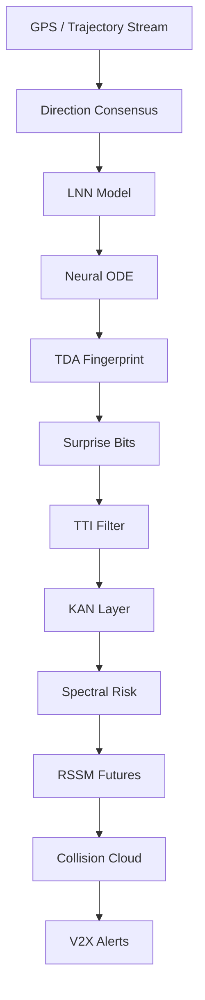

# SwarmMind Safety Net
### 9-Layer Wrong-Way Detection, Collision Prediction & V2X Alert Platform

<p align="center">
  
  
  
  
  
</p>

---

## Overview

SwarmMind Safety Net is a modular traffic safety intelligence system designed to detect wrong-way driving, suppress false positives, predict collision zones, and propagate alerts across nearby vehicles.

The system combines trajectory modeling, anomaly detection, and simulation tooling into a unified, operator-ready platform.

---

## Key Capabilities

- Early wrong-way detection using trajectory and road-direction consensus
- False-positive suppression (construction zones, bike paths, lane confusion)
- Collision-risk forecasting using future trajectory modeling
- V2X-style alert propagation across surrounding vehicles
- Real-world grounding using NGSIM and OSM datasets
- Operator dashboard with simulation playback and diagnostics

---

## Architecture



---

## Benchmark Results

| Model | F1 Score | False Positive Rate |
|---|---|---|
| Baseline | 0.50 | 0.5714 |
| LNN + ODE | 0.80 | 0.1429 |
| Full Stack | **1.00** | **0.00** |

**Additional results:**
- Real-only evaluation: F1 = 1.00, FPR = 0.00
- Wrong-way detection: Precision = 1.00, Recall = 1.00
- Construction suppression: 0 false positives

---

## Project Structure

```
SwarmMind/
├── app.py
├── simulation_engine.py
├── simulation_backend.py
├── ui_toolbox3_panel.py
├── layers/
├── experiments/
├── data/
├── external_data/
├── docs/
├── demo_package/
└── tests/
```

---

## Quick Start

**Run Full System**
```bash
bash run.sh
```

**Start Backend**
```bash
uvicorn simulation_engine:app --reload
```

**Start UI**
```bash
streamlit run ui_toolbox3_panel.py
```

**Run Experiments**
```bash
python3 experiments/exp_1_baseline.py
python3 experiments/exp_2_lnn_ode.py
python3 experiments/exp_3_full_stack.py
```

---

## Data Sources

- [FHWA NGSIM](https://ops.fhwa.dot.gov/trafficanalysistools/ngsim.htm) trajectory dataset
- [OpenStreetMap / Overpass](https://overpass-api.de/) road data
- Synthetic and stress-test scenarios

---

## Why This Project Matters

Wrong-way driving and delayed hazard detection are major contributors to highway accidents. SwarmMind addresses this by shifting traffic safety from reactive systems to **predictive and cooperative intelligence**.

---

## Future Work

- LiDAR and radar integration
- Real-time V2X infrastructure
- Live traffic feed integration
- Smart city deployment

---

## Resume-Ready Description

> Built an AI-based traffic safety system that detects wrong-way vehicles, suppresses false positives, predicts collision risks, and propagates V2X alerts using LNNs, Neural ODEs, and trajectory-based anomaly detection. Achieved F1 score of 1.00 with zero false positives on real-world and stress-test datasets.

---

## License

[MIT License](LICENSE)
