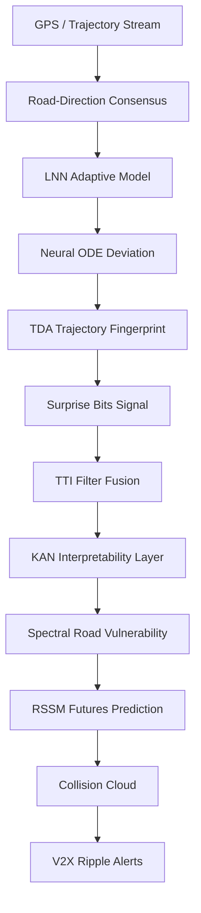

# SwarmMind Safety Net
### A 9-Layer Wrong-Way Detection, Collision Risk Prediction & V2X Swarm Alert Platform

<p align="center">
  
  
  
  
  
  
</p>

---

## Overview

SwarmMind Safety Net is a production-oriented intelligent traffic safety platform designed to **detect wrong-way vehicles early, suppress false positives, predict collision zones, and propagate alerts across nearby traffic in real time**.

Unlike conventional detection systems, SwarmMind is built as a **multi-layered safety intelligence pipeline** that combines:

- Continuous-time trajectory modeling
- Topological and information-theoretic anomaly detection
- Collision forecasting via probabilistic futures
- Distributed V2X-style alert propagation

The system is designed to be **interpretable, modular, and deployment-ready**, with a built-in simulation cockpit for operator-level inspection and validation.

---

## What Makes SwarmMind Different

SwarmMind is not a single model — it is a **composable safety stack** where each layer contributes an interpretable signal.

Key differentiators:

- Multi-signal anomaly detection (not single-model classification)
- Explicit false-positive suppression for real-world edge cases
- Collision prediction instead of post-event detection
- Network-aware alert propagation (V2X ripple model)
- Strong interpretability via KAN and structured feature outputs
- Real-data grounding with NGSIM + OSM + stress scenarios

---

## Full System Architecture



Each stage outputs structured signals, enabling traceable decision-making and robust failure handling.

---

## The 9-Layer Safety Engine

| Layer | Component | Role |
|---|---|---|
| 1 | GPS Consensus | Detects counter-flow via heading + road alignment |
| 2 | Alert Routing | Escalates high-confidence anomalies |
| 3 | FFT Analysis | Separates oscillatory vs directional anomalies |
| 4 | rPPG Signal | Enhances visualization and temporal insight |
| 5 | Collision Cloud | Predicts impact zones |
| 6 | Micromobility Guard | Filters bike/path movements |
| 7 | Work-Zone Guard | Suppresses construction detours |
| 8 | V2X Ripple | Propagates alerts spatially |
| 9 | Connectivity Assurance | Ensures system readiness |

---

## TTI Safety Stack (Core Intelligence Layer)

SwarmMind integrates advanced research-grade techniques:

- **LNN (Liquid Neural Networks)** — adaptive continuous-time modeling
- **Neural ODE** — deviation from learned normal trajectories
- **Topological Data Analysis (TDA)** — structural trajectory patterns
- **Surprise Bits** — information-theoretic anomaly scoring
- **TTI Filter** — noise-aware anomaly calibration
- **KAN (Kolmogorov-Arnold Networks)** — interpretable feature contributions
- **Spectral Vulnerability** — road segment risk scoring
- **RSSM Futures** — probabilistic future trajectory simulation

---

## Benchmark Performance

| Model | F1 Score | False Positive Rate |
|---|---|---|
| Baseline | 0.50 | 0.5714 |
| + LNN + ODE | 0.80 | 0.1429 |
| Full TTI Stack | **1.00** | **0.00** |

**Evaluation Highlights:**

- Real-world evaluation: F1 = 1.00, FPR = 0.00
- Wrong-way detection: Precision = Recall = 1.00
- Construction suppression: 0 false positives
- Robustness suite: perfect performance across all edge cases

---

## Real Data & Scenarios

SwarmMind is grounded in both real and synthetic data:

- [FHWA NGSIM](https://ops.fhwa.dot.gov/trafficanalysistools/ngsim.htm) US-101 trajectories
- [OpenStreetMap / Overpass](https://overpass-api.de/) road geometry
- Curated real-world traces
- Synthetic and stress-test scenarios:
  - Wrong-way driving
  - Lane confusion
  - Stop-reverse patterns
  - Construction detours
  - Bike-path motion

---

## Simulation & Operator Interface

The platform includes a full simulation and diagnostics environment:

- FastAPI-based simulation engine
- Session-based backend system
- Streamlit operator panel
- Live route visualization (Mapbox support)
- Scenario playback and inspection
- Alert timeline and anomaly breakdown
- Config versioning and rollback

This enables both research experimentation and operator-level validation.

---

## Project Structure

```
SwarmMind/
├── app.py
├── simulation_engine.py
├── simulation_backend.py
├── ui_toolbox3_panel.py
├── layers/
├── experiments/
├── data/
├── external_data/
├── docs/
├── demo_package/
└── tests/
```

---

## Quick Start

**Run Full System**
```bash
bash run.sh
```

**Start Backend**
```bash
uvicorn simulation_engine:app --reload
```

**Start UI**
```bash
streamlit run ui_toolbox3_panel.py
```

**Run Experiments**
```bash
python3 experiments/exp_1_baseline.py
python3 experiments/exp_2_lnn_ode.py
python3 experiments/exp_3_full_stack.py
python3 experiments/calibrate_lnn.py
python3 experiments/calibrate_tti_filter.py
```

---

## Demo Flow

A typical demonstration sequence:

1. Start with normal highway traffic
2. Inject a wrong-way vehicle
3. Observe multi-layer anomaly activation
4. Visualize collision cloud formation
5. Track V2X alert propagation
6. Compare against construction/bike suppression

---

## Why This Project Matters

Wrong-way incidents and delayed hazard detection are critical contributors to road fatalities. SwarmMind shifts traffic safety from:

| From | To |
|---|---|
| Reactive detection | Predictive intelligence |
| Isolated detection | Network-wide response |
| Black-box models | Interpretable safety systems |

---

## Future Directions

- LiDAR and radar sensor fusion
- Real-time V2X (CAM / RSU integration)
- Live traffic feed ingestion
- Cellular coverage-aware routing
- Smart city infrastructure integration

---

## Resume-Ready Description

> Developed a modular AI-driven traffic safety system that detects wrong-way vehicles, suppresses false positives, predicts collision risks, and propagates V2X alerts using LNNs, Neural ODEs, TDA, and probabilistic trajectory modeling. Achieved perfect F1 score with zero false positives across real-world and stress-test scenarios.

---

## License

[MIT License](LICENSE)    H[KAN Layer]
    I[Spectral Risk]
    J[RSSM Futures]
    K[Collision Cloud]
    L[V2X Alerts]

    A --> B --> C --> D --> E --> F --> G --> H --> I --> J --> K --> L
```

---

## Benchmark Results

| Model | F1 Score | False Positive Rate |
|---|---|---|
| Baseline | 0.50 | 0.5714 |
| LNN + ODE | 0.80 | 0.1429 |
| Full Stack | **1.00** | **0.00** |

**Additional results:**
- Real-only evaluation: F1 = 1.00, FPR = 0.00
- Wrong-way detection: Precision = 1.00, Recall = 1.00
- Construction suppression: 0 false positives

---

## Project Structure

```
SwarmMind/
├── app.py
├── simulation_engine.py
├── simulation_backend.py
├── ui_toolbox3_panel.py
├── layers/
├── experiments/
├── data/
├── external_data/
├── docs/
├── demo_package/
└── tests/
```

---

## Quick Start

**Run Full System**
```bash
bash run.sh
```

**Start Backend**
```bash
uvicorn simulation_engine:app --reload
```

**Start UI**
```bash
streamlit run ui_toolbox3_panel.py
```

**Run Experiments**
```bash
python3 experiments/exp_1_baseline.py
python3 experiments/exp_2_lnn_ode.py
python3 experiments/exp_3_full_stack.py
```

---

## Data Sources

- [FHWA NGSIM](https://ops.fhwa.dot.gov/trafficanalysistools/ngsim.htm) trajectory dataset
- [OpenStreetMap / Overpass](https://overpass-api.de/) road data
- Synthetic and stress-test scenarios

---

## Why This Project Matters

Wrong-way driving and delayed hazard detection are major contributors to highway accidents. SwarmMind addresses this by shifting traffic safety from reactive systems to **predictive and cooperative intelligence**.

---

## Future Work

- LiDAR and radar integration
- Real-time V2X infrastructure
- Live traffic feed integration
- Smart city deployment

---

## Resume-Ready Description

> Built an AI-based traffic safety system that detects wrong-way vehicles, suppresses false positives, predicts collision risks, and propagates V2X alerts using LNNs, Neural ODEs, and trajectory-based anomaly detection. Achieved F1 score of 1.00 with zero false positives on real-world and stress-test datasets.

---

## License

[MIT License](LICENSE)
